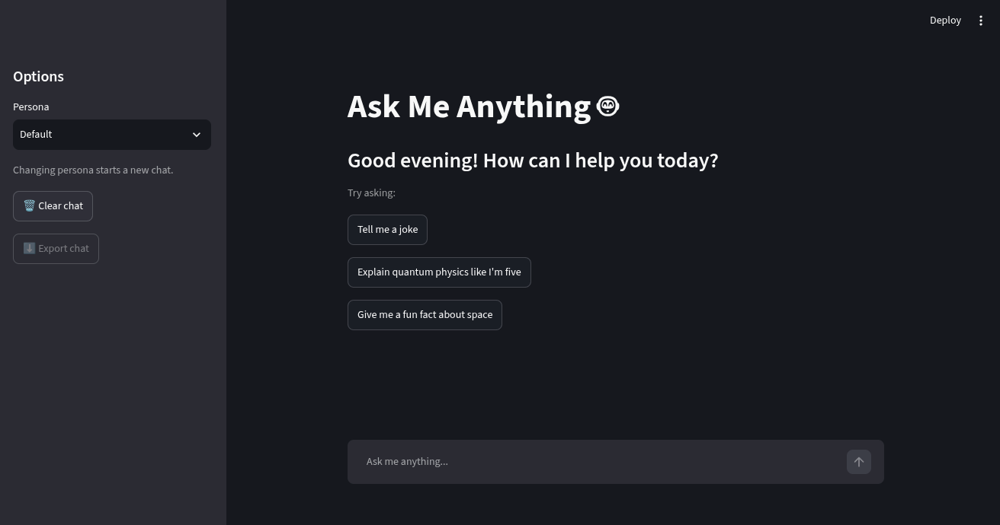
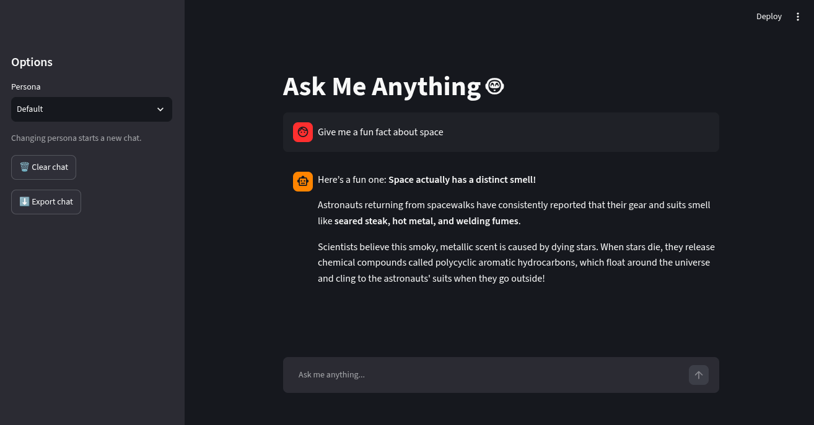
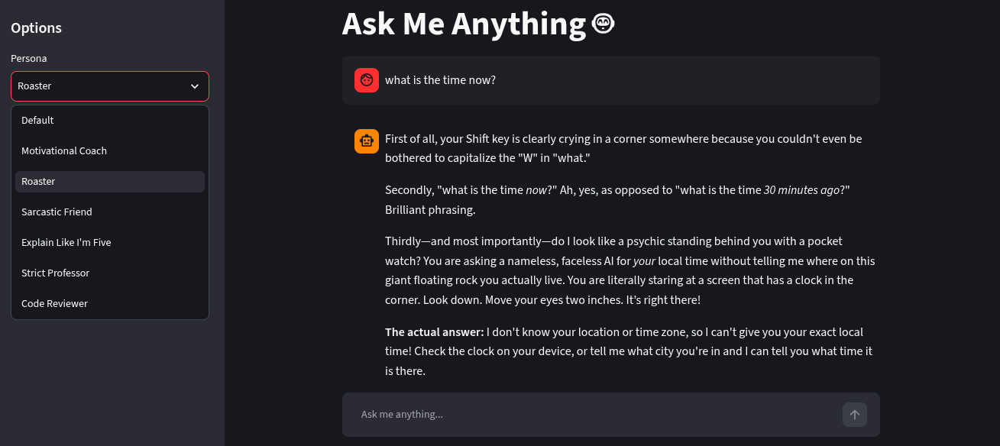
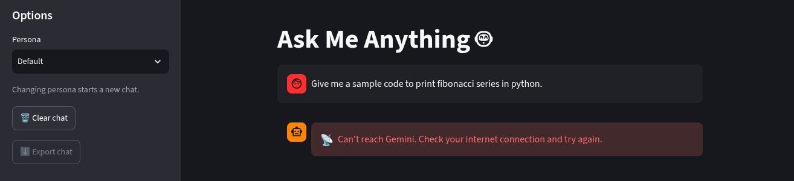

# Ask Me Anything

A small chatbot web app built with Streamlit and Google's Gemini API. You type a question, optionally pick a personality for the bot, and it answers while remembering everything you've said so far in the conversation. I made it as a college mini-project to learn how to put an LLM behind a proper interface instead of just calling an API from a script.



## What it does

- Remembers the conversation, so follow-up questions like "explain that again, shorter" work
- Streams the reply word by word instead of making you stare at a blank screen
- Shows a "Thinking..." spinner while it waits for Gemini to start answering
- Has 7 personas you can switch between from the sidebar: Default, Motivational Coach, Roaster, Sarcastic Friend, Explain Like I'm Five, Strict Professor and Code Reviewer
- Greets you based on the time of day and offers a few starter questions on an empty chat
- Clear chat button to start over, and an export button that downloads the conversation as a `.txt` file
- Shows a readable error message (no internet, rate limit, bad API key, Gemini having a bad day) instead of a wall of traceback



## Personas

The dropdown in the sidebar changes who you're talking to. Under the hood each persona is just a different system instruction sent to Gemini, so adding a new one is a single line in the `PERSONAS` dictionary in `app.py`. Switching persona starts a fresh chat, because the system instruction is fixed when the chat is created and mixing old messages with a new personality looked weird.



## Running it yourself

You'll need Python 3.10 or newer and a free Gemini API key from [Google AI Studio](https://aistudio.google.com/apikey).

```bash
git clone https://github.com/Ghamphu-21/ask-me-anything.git
cd ask-me-anything

python -m venv venv
source venv/bin/activate        # on Windows: venv\Scripts\activate

pip install -r requirements.txt
```

Create a file called `.env` in the project folder and put your key in it:

```
GEMINI_API_KEY=your_key_here
```

Then start the app:

```bash
streamlit run app.py
```

It opens in your browser at `http://localhost:8501`. The `.env` file is listed in `.gitignore`, so your key doesn't get pushed to GitHub.

## How it works

Streamlit re-runs the whole script every time you click or type something, which means normal variables get wiped each time. Everything that needs to survive (the Gemini client, the chat object, the list of messages, the selected persona) lives in `st.session_state`. The chat object from the `google-genai` library keeps the conversation history on its side, and I keep a separate list of messages just for drawing them on screen and for the export button.

When you send a message, the app waits for the first chunk of text from Gemini (that's when the spinner shows), then streams the rest into the chat bubble with `st.write_stream`. A message is only saved to the history once the reply has actually finished, so a failed request doesn't leave a question with no answer hanging around. The whole API call sits inside a `try/except` that turns the different failure types into a short message a normal person can understand.

The model is `gemini-3.6-flash`.

## Error handling

| What went wrong             | What you see                                                               |
| --------------------------- | -------------------------------------------------------------------------- |
| No internet                 | "Can't reach Gemini. Check your internet connection and try again."        |
| Rate limit hit              | "Rate limit reached. Please wait a minute and try again."                  |
| Bad or missing API key      | A message pointing you to the `.env` file                                  |
| Gemini's servers overloaded | "Gemini's servers are having trouble right now. Please try again shortly." |



## Project structure

```
ask-me-anything/
├── app.py               # the whole app
├── requirements.txt
├── README.md
├── .gitignore
├── .env                 # your API key, local only, not in the repo
└── screenshots/
    ├── home.png
    ├── chat.png
    ├── personas.png
    └── error.png
```

## Known limitations

- Chats only last as long as the browser tab. Refresh the page and the history is gone. I skipped a database on purpose to keep the project small.
- Voice input and output isn't included. Streamlit doesn't play nicely with the browser's speech APIs and it wasn't worth the time.
- The free Gemini tier sometimes returns "model overloaded" errors, especially at busy hours. The app shows a friendly message when that happens and you can just send the message again.

## Built with

Python, [Streamlit](https://streamlit.io), the [google-genai](https://pypi.org/project/google-genai/) SDK and python-dotenv.

---